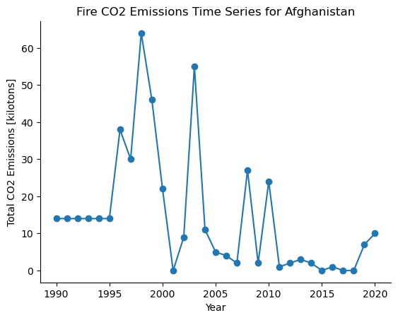
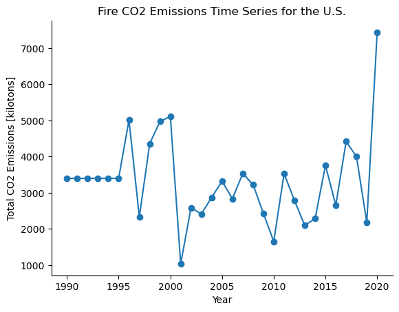
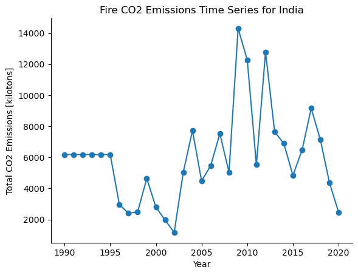

[](https://classroom.github.com/a/oQi7O4AA)
# python-refresher

# Introduction
My submission for the Python Refresher Assignment (Assignment 2)

The goal was to use good practices to create a project that would calculate the total $CO_2$ emissions from fires in the US (which could be extended to any other statistic in the dataset for any other country). For this project, we use the "Agrofood_co2_emission.csv" file provided in the assignment.

From the data description:

```
The agricultural CO2 emission dataset has been constructed by merging and reprocessing approximately a dozen individual datasets from the Food and Agriculture Organization (FAO) and data from IPCC. These datasets were, cleaned, preprocessed and merged together to create a comprehensive and cohesive dataset for analysis and forecasting purposes. 

The dataset, as demonstrated in the notebook, describes CO2 emissions related to agri-food, which amount to approximately 62% of the global annual emissions.
```

# Results
I wanted to try to track the $CO_2$ emissions from year to year for a few countries and see how they changed over time, especially with the advent of the global temperature rising. I chose the United States, Afghanistan, and India as my countries of interest (but the method could be extended further by adding more countries into `src/countries.txt`).

It was interesting to note that until 1995, all countries had a *static* amount of emissions from fires, I believe this could be attributed to some discrepancies in data collection before 1995, and the filling in of missing data with some statistical facet of the data. 

This code aggregates fires from all sources (savannah, forest, organic soil and humid tropical forest fires) and calculates the total emissions from fires in the a country for the time range of data provided in the data source.

Taking a look at the three graphs produced: 


Here we can see that from 1996 to 2015 there was a general trend of decreasing emissions from fires in Afghanistan. It is interesting to note that from 2001 to 2021 there was a war in Afghanistan, and I suspect that this could have contributed to some of the sporadicity in the emissions from fires. Additionally, from 2017 onwards, the emissions have started to rise once again, in a gradual manner (as opposed to the high jumps earlier).



Here, there is also a bit of jumpy sporadicity, but unlike the data in Afghanistan, there is a general trend of more and more emissions from fires, with 2020 having the highest level of emissions. Much of this can be attributed to rising global temperatures, and we've seen the effects even here in Boulder: this last summer (2023) was the hottest summer on record, and we had a lot of fires in the mountains. The NCAR fire also occured recently due to the dry conditions and high temperatures.



Here there is also a degree of sporadicity, but interestingly, after 2017, the level of emissions seems to be trending downwards. The emissions peaked in 2010 and 2013. 

Note that the ranges of fires are different for each country: this is due to differences in geographical variety, and economic circumstances. Afghanistan is a country with mountains and dry deserts, and as such there's less capacity for savannah, forest, organic soil, and tropical forest fires. This could be why the range of emissions is so low (0 $\rightarrow$ 60 kt of $CO_2$ emissions). The United States has a wide diversity of geographical features, and as such there's a lot of capacity for fires from vegetation, and this is why the range of emissions is so high (~1000 $\rightarrow$ ~7000 kt). India is a country with a similar geographical diversity, but also a wide level of agricultural land (where farmers purpousefully burn crops to clear their land for the next season), as well as a large population, and less stringent environmental regulations. This could be why the range of emissions is so high (~1000 $\rightarrow$ ~14000 kt).

# Methods
In order to get these results, the countries of interest were entered into `src/countries.txt`, and then `snakemake` was run in the home directory. To get more specific statistics, one could rerun the commands entered in `run.sh` with different statistical flags specified. 

# Code
## Installation and Usage
Clone the GitHub Repository and run the following command in the terminal:
```bash
$ bash run.sh
```
This will print the total emissions from forest fires in the US for the range of data provided in the data source. The bash script has 4 working commands, and 2 commands that should throw an error to test the error handling.

## Usage of `print_fires.py`
The data source provided can be passed in several ways - unique fire sources can be specified, or all types of fires (savannah, forest, organic soil and humid tropical forest fires).

`print_fires.py` can be called in the following format
```
usage: print_fires.py --country COUNTRY --file_name FILE_NAME 

Calculate CO2 emissions from fires in a country

optional arguments (at least one source must be specified)
--all_fires                                 Calculate emissions from all fire sources

--savannah_fires_column                     Column number for savannah fires (default 2)

--forest_fires_column                       Column number for forest fires (default 3)

--organic_soil_fires_column                 Column number for organic soil fires (default 22)

--humid_tropical_forest_fires_column        Column number for humid tropical forest fires (default 23)

--mean                                      Calculate the mean of the emissions from the specified country (default False)

--median                                    Calculate the median of the emissions from the specified country (default False)  

--stdev                                     Calculate the standard deviation of the emissions from the specified country (default False)

--output_file OUTPUT_FILE                   Save the time series data to a file with the specified name (e.g., 'Country.txt') (default None)
```

To save the time series data to a file, use the --output_file flag followed by the desired file name. For example:
```bash
python print_fires.py --country 'United States of America' --file_name 'Agrofood_co2_emission.csv' --all_fires True --output_file 'United States of America.txt'
```

Note that a fire source (either a combination of specific sources or `--all_fires`) will need to be specified.

### All fire types
```bash
python print_fires.py --country 'United States of America' --file_name 'Agrofood_co2_emission.csv' --all_fires True
```

### All fire types, naming specific sources, and indicating specific columns
```bash
python print_fires.py --country 'United States of America' --file_name 'Agrofood_co2_emission.csv' --savannah_fires_column 2 --forest_fires_column 3 --organic_soil_fires_column 22 --humid_tropical_forest_fires_column 23
```

### Specifying only two fire sources
```bash
python print_fires.py --country 'United States of America' --file_name 'Agrofood_co2_emission.csv' --savannah_fires_column --forest_fires_column
```

### Calculating the median of the emissions from each fire source in the specified country
```bash
python print_fires.py --country 'United States of America' --file_name 'Agrofood_co2_emission.csv' --all_fires --mean True
```

The above command can also be replaced with `--median` or `--stdev` for the median and standard deviation respectively 

## Data Source
The data source was the provided `Agrofood_co2_emission.csv` file. This datafile provides information on Carbon Dioxide emissions by country and year. The level of $CO_2$ emissions are given in units of [kilotons].

In order to ensure proper functionality, please place the data file in the same directory as the `print_fires.py` file.

## Testing
Unit tests are contained within `tests/unit_tests/` and can be run by moving into the `tests/unit_tests` directory and running
```bash
python -m unittest tests/unit_tests/test_my_utils.py
```

This assignment used the [Stupid Simple baSh Testing](https://github.com/ryanlayer/ssshtest) framework for functional testing. Simply move into the `functional_tests` run 
```bash
$ bash test_print_fires.sh
```
And sshtest will be installed, and the tests will be run automatically. 

## License
MIT License
