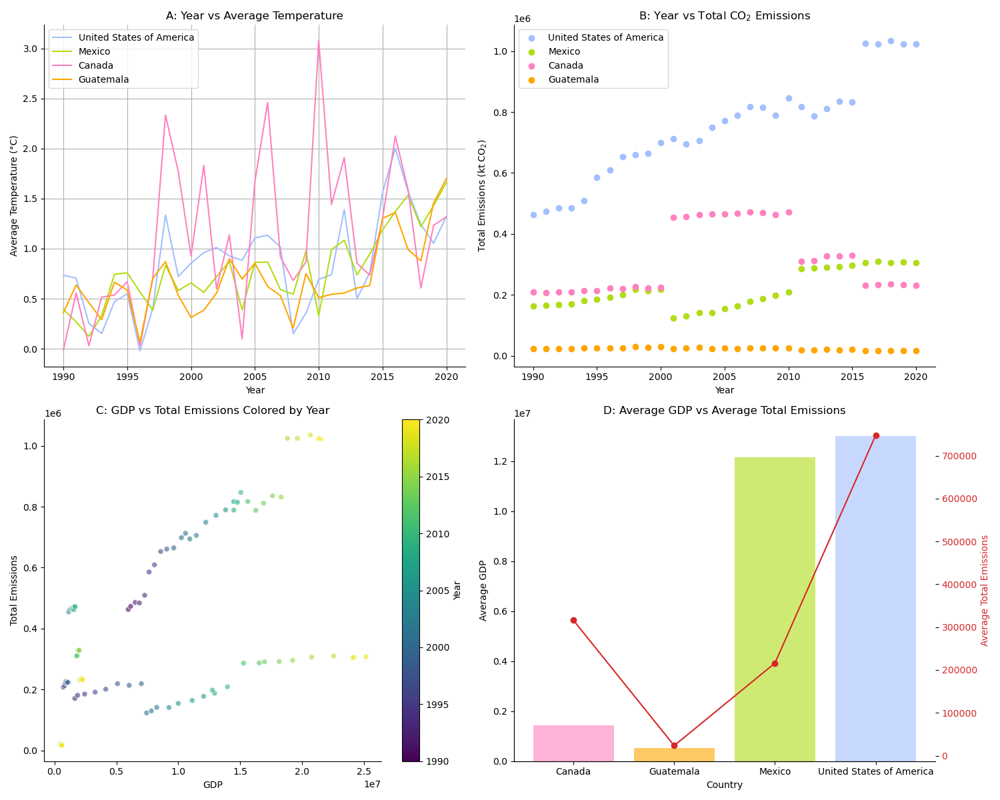

# Assignment 9 - Using Libraries
## Making a report for Uncle John

Uncle John,

I realize that you don't quite believe in climate change, and have been working my butt off to show otherwise. What I have presented in the four panel graph above are figures as a result of my analysis regarding patterns in temperature, carbon dioxide ($CO_2$) emissions, and GDP for the four mainland north american countries: the U.S., Mexico, Canada, and Guatemala.

Figure (A) is a Line plot of Year vs average temperature
- In this plot you can see, that despite sporadicity and jumping of the line from year to year, the general trend across all four countries is upwards. 
- From 1990 to 2020, the average temperature has steadily risen. This clearly demonstrates the creeping effect of climate change: the climate is very demonstrably changing!
- Let's dig into this further with some more analyses: specifically regarding carbon dioxide emissions. Carbon dioxide is a greenhouse gas (meaning that it traps heat in the atmosphere), and is a byproduct of burning fossil fuels. The more fossil fuels we burn, the more $CO_2$ we release into the atmosphere, and the more heat is trapped in the atmosphere, thus the rising temperature. 
- Let's dig into this further

Figure (B) is a Scatter plot plot of Year vs total $CO_2$ emissions
- You can see that over the years, all of the countries (save Guatemala) have significantly grown their carbon emissions. There are jumps in the data, and a fall in the carbon emissions put out by canada, but the levels of every country are much higher than they were back in 1990. 

Figure (C) is a Scatter plot of GDP vs Total emissions colored by year
- Here you can see a generally positive correlation between GDP and total emissions. 
- This makes sense, as the more money a country has, the more industrialized it is, and the more fossil fuels it burns. (Or perhaps vice versa, the more fossil fuels it burns to support industry, the more money it makes).
- You can also see that through the years (the lighter colors) the GDP and total emissions both tend to rise (trending to the upper right of the graph). 
- This indicates that as time goes on, the countries are becoming more industrialized, and thus burning more fossil fuels, and thus releasing more $CO_2$ into the atmosphere, and thus trapping more heat in the atmosphere, and thus raising the temperature.

Figure (D) is a Bar chart with two axes showing the average GDP vs Average total emissions
- As a final analysis, if we do a dual comparison of the GDP of countries and their mean $CO_2$ emissions, we can see a pretty direct correlation of the patterns in both
- The more industrialized the country (and the higher the GDP), the more $CO_2$ it emits.

I know that this may not convince you but if I had the time and resources imaginable, I'd include further analyses across the global west vs. the global south to show that this isn't a one-off occurance, and that the entire world is being affected by not only climate change but excessive industrialization in the west, and the global south disproportionaly suffers the consequences. I could also include analyses on even more specific regions across the U.S., overlaying a heatmap of industrial areas with high $CO_2$ emissions, and overlay it with a map showing GDP per capita, or perhaps temperature fluctuations in specific regions. 